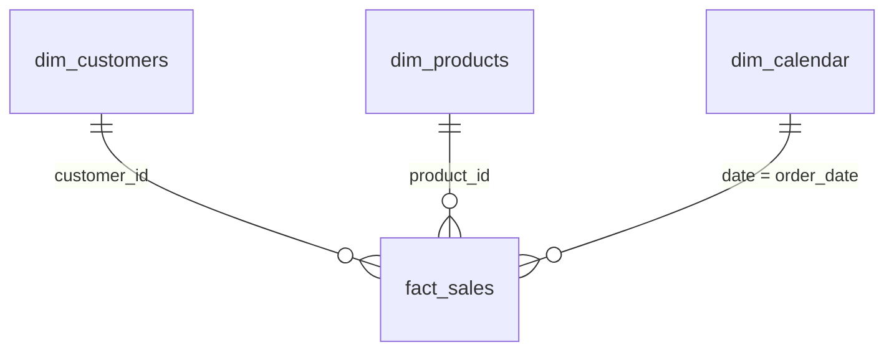

# Scents in Hands | Sales & Performance Analytics Dashboard


An end-to-end business intelligence project for a fragrance e-commerce brand. It covers synthetic data generation, a star-schema data model, DAX measures and a interactive Power BI dashboard (cover page plus 3 analysis pages) that answers questions about sales, products, customers and operations.

> **Disclaimer:** All data in this project is **synthetic** (computer-generated) and was created for portfolio purposes only. It does not represent real sales, customers or performance. This project is not affiliated with or endorsed by the brand.

---

## Table of Contents

1. [Project Overview](#project-overview)
2. [Dashboard Preview](#dashboard-preview)
3. [Key Results](#key-results)
4. [Dataset](#dataset)
5. [Data Model](#data-model)
6. [DAX Measures](#dax-measures)
7. [Key Insights and Recommendations](#key-insights-and-recommendations)
8. [Assumptions and Limitations](#assumptions-and-limitations)
9. [Repository Structure](#repository-structure)
10. [How to Open the Project](#how-to-open-the-project)
11. [Skills Demonstrated](#skills-demonstrated)
12. [Author](#author)

---

## Project Overview

**Objective:** Give management a single, interactive view of sales performance so they can see what drives revenue, who the customers are, and where operations can improve.

**Business questions answered**
- How are revenue, orders and profit trending over time, and how does this year compare with last year?
- Which products, categories and cities contribute the most?
- Who are the customers (age, gender) and how many of them come back?
- How healthy are operations: cancellations, returns and payment methods?
- How much do discount codes contribute to sales?

---

## Dashboard Preview

### Cover Page
Landing page with navigation buttons to each analysis page.

[ 

### 1. Executive Summary
KPIs, monthly revenue trend, revenue by category and city.


### 2. Product & Customer Insights
Top products, margin by category, revenue by age group and gender split.


### 3. Operations & Performance
Order status, payment methods and discount code performance.


Interactive features: cover page with page navigation, synced year slicer, and category, city, age group and payment method slicers.

---

## Key Results

Figures below are for the full period with cancelled orders excluded.

| KPI | Value |
|---|---|
| Total Revenue | 41.68M PKR |
| Total Orders | 4,579 |
| Average Order Value | about 9,100 PKR |
| Gross Profit | 25.50M PKR |
| Profit Margin | 61.7% |
| Revenue growth (Jan to Sep 2026 vs same period 2025) | +50.7% |
| Return Rate | 4.4% |
| Cancel Rate | 5.3% |
| Discount Rate | 3.6% |

---

## Dataset

The dataset was generated with Python (pandas and NumPy) to behave like real e-commerce data.

- **Period:** January 2025 to September 2026
- **Volume:** 4,836 orders, 8,636 order lines, 2,800 customers, 31 products
- **Currency:** PKR
- **Realistic patterns:** growth trend, seasonal peaks (Eid, Valentine's Day, Black Friday, 11.11, 12.12, wedding season), repeat purchases, promo codes, cancellations and returns
- **Quality checks:** no duplicate rows, no orphan keys, every order total reconciles to its line items, consistent data types

---

## Data Model

The model follows a **star schema**: one fact table connected to three dimension tables by one-to-many relationships.



| Table | Type | Grain and contents |
|---|---|---|
| `fact_sales` | Fact | One row per order line: quantity, price, cost, discount, shipping, net total, profit, order status, payment method |
| `dim_customers` | Dimension | One row per customer: city, province, age group, gender, acquisition channel |
| `dim_products` | Dimension | One row per product: category, fragrance family, size, price, cost |
| `dim_calendar` | Dimension | One row per day (2025 to 2026): year, quarter, month, week, weekday |

**Design decision:** Order-level discount and shipping were allocated across order lines in proportion to line value. This keeps totals additive in a single fact table and avoids double counting.

---

## DAX Measures

| Measure | Purpose |
|---|---|
| Total Revenue, Total Orders, Avg Order Value | Core sales KPIs (cancelled orders excluded) |
| Gross Profit, Profit Margin % | Profitability after discounts and product cost |
| Revenue LY, Revenue YoY % | Time intelligence, compared up to the last date with sales |
| Active Customers, Repeat Customer % | Customer retention |
| Cancel Rate %, Return Rate %, Discount Rate % | Operational and promotion health |
| % of Total Revenue | Share of total in any visual |

```DAX
Total Revenue =
CALCULATE(
    SUM(fact_sales[line_net_total]),
    fact_sales[order_status] <> "Cancelled"
)

Revenue LY =
VAR LastSaleDate = CALCULATE(MAX(fact_sales[order_date]), ALL(fact_sales))
RETURN
CALCULATE(
    [Total Revenue],
    SAMEPERIODLASTYEAR(dim_calendar[date]),
    dim_calendar[date] <= EDATE(LastSaleDate, -12)
)

Revenue YoY % =
IF(
    HASONEVALUE(dim_calendar[year]),
    DIVIDE([Total Revenue] - [Revenue LY], [Revenue LY])
)
```

---

## Key Insights and Recommendations

| Insight | Suggested action (illustrative) |
|---|---|
| **Perfume is about 82% of revenue**; the other five categories share the remaining 18% | Reduce category concentration by promoting gift sets and body mists through bundles |
| **Karachi (31%) and Lahore (23%)** generate about 54% of revenue | Test targeted campaigns in Islamabad and Rawalpindi, the next largest cities |
| **December 2025 was the peak month** (2.86M), driven by Black Friday and wedding season | Plan stock and ad spend ahead of November to December and Eid |
| **Cash on Delivery is about 59% of revenue** | Offer small incentives for prepaid methods to reduce cancellation and return risk |
| **Only about 36% of orders use a discount code**, and code orders have a lower average value than non-code orders | Use discounts selectively, focusing on WELCOME10 for acquisition |
| **The 25-34 age group spends the most**, and women place about 62% of orders | Focus creative and channel mix on this segment |

---

## Assumptions and Limitations

- Data is synthetic, so patterns reflect the generation rules and should not be read as real market findings.
- Revenue figures exclude cancelled orders. Returned orders are included unless stated otherwise.
- Gross profit is based on product cost and discounts only; shipping and marketing costs are not included.
- Year-over-year comparison for 2026 covers January to September only, so it is compared with the same months of 2025.

---

## Repository Structure

```
├── README.md
├── powerbi/
│   └── sales_dashboard.pbix
└── screenshots/        (dashboard images)
```

---

## How to Open the Project

1. Download `powerbi/sales_dashboard.pbix`.
2. Open it in **Power BI Desktop** (free from Microsoft).
3. The data is embedded in the file, so no extra setup is needed.

---

## Skills Demonstrated

Data modeling (star schema) | DAX and time intelligence | Data cleaning and validation | Dashboard design and storytelling | Business insight and recommendations | Python data generation | Excel and CSV handling

---

## Author

**Amna Tabish** | Data Analyst

- GitHub: [Amna-tabish](https://github.com/Amna-tabish)
- Email: [shifaworkmahib@gmail.com](mailto:shifaworkmahib@gmail.com)

*Open to remote and freelance data analytics projects.*
# scents-in-hands-powerbi-dashboard
Power BI sales dashboard with star schema and DAX
